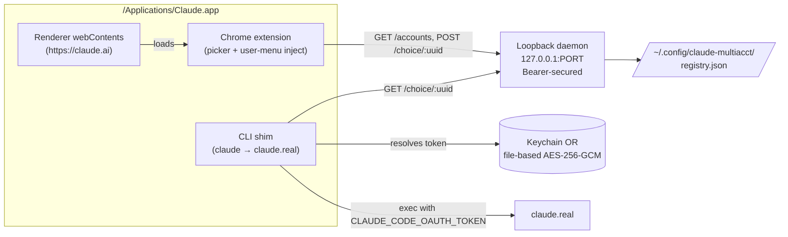

# claude-multiacct

[](https://github.com/kaelys-js/claude-multiacct/actions/workflows/ci.yml)

**Pool multiple Anthropic OAuth accounts inside a single `/Applications/Claude.app`. Switch accounts per Code-tab session from a picker mounted next to the model selector.**

The whole flow lives inside one Claude Desktop app — no bundle patching, no re-signing, no clone apps, no launchd polling. A tiny loopback daemon holds the pool state, a Code-tab extension paints the picker, and a CLI shim swaps `CLAUDE_CODE_OAUTH_TOKEN` between the real `claude` binary and each session's chosen account.

## Quick start

```sh
git clone https://github.com/kaelys-js/claude-multiacct ~/Documents/work/@personal/claude-multiacct
cd ~/Documents/work/@personal/claude-multiacct
mise install                 # pins the toolchain (Node 26, pnpm, mise plugins)
pnpm install --frozen-lockfile
pnpm --filter @foundation/claude-multiacct build

# Install the runtime (four subsystems: shim, watcher, daemon, extension)
CLAUDE_MULTIACCT_ENABLE_SHIM=1 node \
  packages/products/claude-multiacct/dist/cma.js install

# Launch Claude via the wrapper so it picks up the extension + host-resolver rules
CLAUDE_MULTIACCT_ENABLE_SHIM=1 node \
  packages/products/claude-multiacct/dist/cma.js launch
```

Once installed, open Claude → Code tab. The picker appears next to the model selector (`Opus 4.7`). It shows every registered account; click to switch. Existing sessions pick up the swap on their next `claude` process spawn.

## Architecture



Four subsystems, all flag-gated on `CLAUDE_MULTIACCT_ENABLE_SHIM=1`:

| Subsystem     | Role                                                         | Where              |
| ------------- | ------------------------------------------------------------ | ------------------ |
| CLI shim      | Intercepts `claude` spawn, swaps OAuth token env per session | `src/cli-shim/`    |
| Watcher       | Reapplies shim on Claude auto-update                         | `src/watcher/`     |
| Bridge daemon | Loopback HTTP API — accounts, choices, usage                 | `src/http-bridge/` |
| Extension     | Picker in Code tab + user-menu injection                     | `src/extension/`   |

The extension loads via Claude's own React DevTools loader path — no asar patching. The launch wrapper blackholes `clients2.google.com` via `--host-resolver-rules` so the loader always uses the local cache we planted.

## Usage

### Auto-detect (default)

`bin/cma install` sets up the runtime; opening Claude.app is enough — the picker shows every discovered account:

1. Main `/Applications/Claude.app`'s signed-in accounts (extracted from its Chromium LevelDB using the `Claude Safe Storage` keychain key)
2. Any legacy `~/Applications/Claude Account *.app` clone apps
3. Every `Claude Code-credentials-*` slot in your login keychain

Tokens land in the daemon's own keychain slot (or file-based fallback at `~/.config/claude-multiacct/tokens/<uuid>` encrypted AES-256-GCM if keychain writes require interactive unlock).

### Manual add (edge case)

```sh
security find-generic-password -w -s "Claude Code-credentials-<hash>" \
| CLAUDE_MULTIACCT_ENABLE_SHIM=1 node \
  packages/products/claude-multiacct/dist/cma.js account add --stdin --label=work
```

Set an account as primary:

```sh
CLAUDE_MULTIACCT_ENABLE_SHIM=1 node \
  packages/products/claude-multiacct/dist/cma.js account set-primary --label=work
```

## Uninstall

`bin/cma uninstall` removes every subsystem it installed. On a machine that also ran the legacy bash-based multi-clone tool that preceded this TypeScript rewrite, `bin/cma install` also detects + prompts to remove old artifacts:

- `~/Applications/Claude Account *.app` clone apps
- Launchd agents: `com.user.claude-{sessions-sync,clone-refresh,primary-patch-refresh,metadata-symlink}`
- Legacy `bin/claude-multiacct` in `$PATH`
- `~/Library/Application Support/Claude-*/` mirror stores (except the current TS-system's own)

Pass `--yes` to skip the confirmation prompt (idempotent — safe to re-run).

## Upstream sync

This repo is a fork of [kaelys-js/foundation-registry](https://github.com/kaelys-js/foundation-registry). Shared packages (`packages/shared/`, mise config, lint config, CI) are periodically pulled from upstream via `.github/workflows/sync-upstream.yml`. Manual sync:

```sh
pnpm sync-upstream        # dry-run: shows a table of what would merge
pnpm sync-upstream --apply
```

## Development

```sh
pnpm install --frozen-lockfile
pnpm --filter @foundation/claude-multiacct build
pnpm qa:lint
pnpm qa:format:check
pnpm qa:test
pnpm qa:test:coverage     # >=90% behaviour+intent
```

## Security

Report security issues privately per [SECURITY.md](SECURITY.md). Do not open public issues for vulnerabilities.
