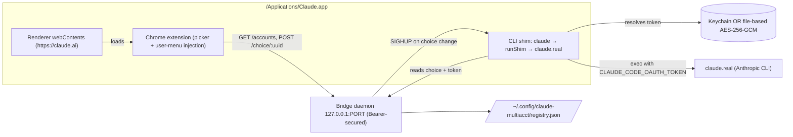

# Architecture

`claude-multiacct` is four cooperating subsystems inside a single, unmodified `/Applications/Claude.app`. No bundle patching, no re-signing, no clone apps.

## Subsystems

### 1. CLI shim (`packages/products/claude-multiacct/src/cli-shim/`)

Installed at `/Applications/Claude.app/Contents/Resources/app.asar.unpacked/claude-code/claude/claude.app/Contents/MacOS/claude`. The original binary is renamed to `claude.real` in the same directory. Every spawn of `claude` from Claude Desktop runs the shim first:

1. Parses `--resume=<sessionUuid>` from argv.
2. Reads the session's account choice from the sidecar store.
3. Fetches that account's OAuth token from the layered token store (Keychain → file fallback).
4. Applies `CLAUDE_CODE_OAUTH_TOKEN` to the env.
5. Writes the shim's PID to `~/.claude-multiacct/sessions/<sessionUuid>.pid` (for the daemon's hot-swap signal).
6. Registers `SIGHUP` → kill child, respawn with fresh token.
7. Spawns `claude.real` with the swapped env; forwards its exit code.

Every failure path falls through to the original env — the user's primary-account behavior is never made worse by the shim being installed.

### 2. Bridge daemon (`packages/products/claude-multiacct/src/http-bridge/`)

A tiny loopback HTTP server bound to `127.0.0.1:<ephemeral>`, launched by launchd (`com.claude-multiacct.bridge-daemon`). Bearer-token auth (`x-cma-bridge-secret`) with strict allowlisted origins (`https://claude.ai`, `chrome-extension://<id>`). Chrome Private Network Access preflight header set so extension → 127.0.0.1 fetches aren't blocked.

Routes:

- `GET /health` — liveness; no auth.
- `GET /accounts` — the pool.
- `GET /usage/:accountUuid` — real Anthropic usage for one account.
- `POST /choice/:sessionUuid` — persist the picker's choice AND fire `SIGHUP` to the owning shim (mid-session hot-swap).

On boot, the daemon runs `discoverAccounts()` — scans main Claude.app + clone bundles + `claude` CLI keychain slots — and auto-registers every unique OAuth token it finds.

### 3. Extension (`packages/products/claude-multiacct/src/extension/`)

Loaded via Claude's own React DevTools loader path (`electron-devtools-installer` cached CRX at `~/Library/Application Support/Claude/Extensions/`). Content script fires on `https://claude.ai/*`, finds the model-selector button via text-content fallback (`Opus|Sonnet|Haiku …`), and mounts a picker next to it. Per-account usage rows are injected into Claude's own user-menu popup.

### 4. Registry + token stores

- `registry.json` at `~/.config/claude-multiacct/` — validated by valibot: exactly one primary, unique uuids, unique labels.
- Keychain-primary token store (`com.claude-multiacct.tokens`), with an AES-256-GCM file-based fallback at `~/.config/claude-multiacct/tokens/<uuid>` for sessions where Keychain writes are refused (SSH, launchd, daemon context).

## Non-goals

- Editing Claude Desktop's bundle or asar contents.
- Cloning Claude.app.
- Persistent modifications to macOS state outside `~/.config/claude-multiacct/`, `~/.claude-multiacct/`, and the shim install at `/Applications/Claude.app/…/claude`.
